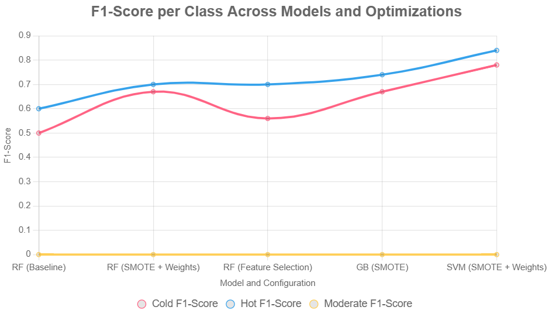

# The-Cold-The-Warm-and-the-Moderate
**A machine learning project to classify foods into Cold, Hot, and Moderate temperaments based on nutritional data, inspired by traditional medicine.**

### Introduction

In traditional medicine, foods are classified into Cold, Hot, or Moderate temperaments based on their physiological effects, a practice rooted in cultural wisdom. Our project, "The Cold, The Warm, and The Moderate" seeks to bridge this traditional knowledge with modern nutritional science by using machine learning to predict food temperaments from nutritional data sourced from the USDA’s Food and Nutrient Database for Dietary Studies (FNDDS). Our goal is to investigate whether nutritional profiles correlate with traditional temperament classifications, potentially validating or refining these ancient categorizations. We collected 100 food samples, applied Principal Component Analysis (PCA) on 85 and 100 samples to reduce dimensionality, and used K-Means clustering to explore natural groupings. Machine learning models (Random Forest, Gradient Boosting, SVM) were trained, with Gradient Boosting achieving 81.58% accuracy and a 0.80 Moderate F1-Score after human-in-the-loop validation. PCA highlighted key nutrients like protein, lipids, and vitamins, while K-Means suggested four clusters with partial temperament alignment. The results indicate a promising relationship between nutritional data and traditional classifications, with opportunities for further data collection and analysis to deepen insights.

### Project Steps
The project followed a structured pipeline to analyze the relationship between nutritional data and traditional temperament classifications:

**Data Collection from FNDDS:**

**Source:** We sourced nutritional data from the USDA’s Food and Nutrient Database for Dietary Studies (FNDDS), a comprehensive database of foods and their nutrient compositions.
**Process:** Selected 100 food samples with features like protein, total lipid fat, carbohydrates, energy (kcal), and vitamins (e.g., vitamin A, D, C). Each food was labeled with a temperament (Cold: 0, Hot: 1, Moderate: 2) based on traditional medicine references.
**Initial Dataset:** Started with 85 samples, later expanded to 100 through additional data collection or validation. The dataset (food_nutrient_temperament.csv) included food_id, temperament, and 26 nutritional features.

**raw data link:** https://fdc.nal.usda.gov/fdc-datasets/FoodData_Central_survey_food_csv_2024-10-31.zip

**Data Preparation for Analysis and Model Training:**

**Cleaning:** Removed duplicates, handled missing values (filled with 0 for numerical features), and validated temperament labels (Cold, Hot, Moderate). 
**Feature Engineering:** Scaled features using StandardScaler to normalize nutritional values. Applied SMOTE to address the imbalanced Moderate class (11 samples in the initial 99-sample dataset).
**Output:** Prepared a dataset ready for PCA, clustering, and model training, with features standardized and balanced.

**PCA on Initial 85-Sample Dataset:**

**Objective:** Reduced the dimensionality of the 26 nutritional features to identify key components driving temperament differences.
**Method:** Applied PCA to the 85-sample dataset, retaining the top components (e.g., 2 or 3) explaining significant variance. Visualized the data in 2D to assess class separability.
**Findings:** PCA showed partial separation of Cold, Hot, and Moderate classes, with Moderate samples often overlapping due to their scarcity. Key nutrients like protein, lipids, and energy were prominent in the first principal components.

### PCA on 100-Sample Dataset:

**Method:** Applied PCA to the expanded 100-sample dataset, retaining the top 5 components (PC1-PC5). The results, provided below, highlight feature contributions to each component.
**Findings:** PC1 was heavily influenced by protein (-0.301), lipids (-0.329), energy (-0.365), and potassium (-0.333). PC2 emphasized carbohydrates (0.414) and sugars (0.322). PC3 and PC4 highlighted vitamins K and thiamin, and calcium and vitamin A, respectively. These suggest nutritional profiles align with temperament distinctions to some extent.

### PCA Results (100-Sample Dataset)

The table below shows the loadings of nutritional features for the first five principal components (PC1-PC5), indicating their influence on temperament classification.

| Feature                            | PC1         | PC2         | PC3         | PC4         | PC5         |
|------------------------------------|-------------|-------------|-------------|-------------|-------------|
| Protein (g)                        | -0.301      | -0.250      | -0.105      | 0.038       | 0.185       |
| Total Lipid Fat (g)                | -0.329      | 0.013       | 0.090       | 0.014       | -0.256      |
| Carbohydrate by Difference (g)     | -0.095      | 0.414       | -0.026      | -0.162      | 0.201       |
| Energy (KCAL)                      | -0.366      | 0.077       | 0.045       | -0.029      | -0.129      |
| Alcohol Ethyl (g)                  | 0.000       | 0.000       | 0.000       | 0.000       | 0.000       |
| Water (g)                          | 0.377       | -0.142      | -0.023      | 0.063       | 0.013       |
| Caffeine (mg)                      | 0.000       | 0.000       | 0.000       | 0.000       | 0.000       |
| Total Sugars (g)                   | 0.014       | 0.322       | -0.055      | -0.083      | -0.073      |
| Calcium Ca (mg)                    | -0.078      | 0.205       | -0.236      | 0.539       | 0.092       |
| Magnesium Mg (mg)                  | -0.168      | -0.250      | 0.084       | 0.085       | -0.059      |
| Phosphorus P (mg)                  | -0.249      | 0.091       | -0.042      | 0.354       | -0.140      |
| Potassium K (mg)                   | -0.333      | -0.071      | -0.005      | 0.033       | -0.013      |
| Sodium Na (mg)                     | -0.261      | 0.197       | 0.249       | -0.087      | 0.119       |
| Zinc Zn (mg)                       | -0.109      | -0.317      | -0.051      | -0.224      | 0.328       |
| Copper Cu (mg)                     | -0.325      | -0.130      | 0.100       | -0.117      | 0.052       |
| Vitamin A, RAE (ug)                | -0.007      | 0.136       | -0.259      | 0.489       | 0.171       |
| Vitamin D (D2 + D3) (ug)           | 0.070       | -0.208      | 0.309       | 0.140       | -0.011      |
| Vitamin C, Total Ascorbic Acid (mg)| 0.075       | -0.008      | -0.173      | 0.088       | -0.237      |
| Thiamin (mg)                       | 0.117       | 0.006       | 0.520       | 0.249       | 0.167       |
| Riboflavin (mg)                    | -0.203      | 0.208       | 0.046       | -0.050      | 0.329       |
| Vitamin B-6 (mg)                   | -0.230      | -0.169      | 0.029       | 0.133       | -0.161      |
| Vitamin B-12 (ug)                  | -0.019      | -0.307      | -0.231      | 0.139       | 0.183       |
| Vitamin K (Phylloquinone) (ug)     | 0.068       | -0.022      | 0.519       | 0.293       | 0.211       |
| Folic Acid (ug)                    | 0.007       | 0.113       | -0.131      | -0.085      | 0.571       |
| Vitamin E, Added (mg)              | 0.000       | 0.000       | 0.000       | 0.000       | 0.000       |
| Vitamin B-12, Added (ug)           | 0.000       | 0.000       | 0.000       | 0.000       | 0.000       |
| Cholesterol (mg)                   | -0.019      | -0.348      | -0.174      | 0.057       | 0.174       |

**Key Observations**:
- **PC1**: Dominated by negative loadings for energy (-0.366), lipids (-0.329), potassium (-0.333), and protein (-0.301), and a positive loading for water (0.377), suggesting high-energy, high-fat foods versus water-rich foods.
- **PC2**: Strong positive loadings for carbohydrates (0.414) and sugars (0.322), indicating a carbohydrate-sugar axis.
- **PC3**: High loadings for thiamin (0.520) and vitamin K (0.519), with vitamin D (0.309), highlighting vitamin-driven differences.
- **PC4**: Driven by calcium (0.539) and vitamin A (0.489), suggesting mineral and vitamin A influence.
- **PC5**: Notable for folic acid (0.571), riboflavin (0.329), and zinc (0.328), indicating micronutrient contributions.

### K-Means Clustering

We applied K-Means clustering with four clusters to the PCA-transformed 100-sample data to explore natural groupings. The mean feature values for each cluster were:

**Cluster 0:** High in sodium (599 mg), energy (541.78 kcal), and potassium (402.96 mg), suggesting processed or energy-dense foods.

**Cluster 1:** High in water (79.51 g), vitamin D (67.33 ug), and vitamin K (55.62 ug), indicating water-rich, vitamin-heavy foods.

**Cluster 2:** High in zinc (435.88 mg), potassium (251.10 mg), and cholesterol (100.71 mg), possibly aligning with protein-rich foods.

**Cluster 3:** High in vitamin A (180.50 ug), energy (176.50 kcal), and calcium (95.00 mg), suggesting nutrient-dense foods.

### Machine Learning Analysis Report
**Why We Chose These Models**
We selected Random Forest, Gradient Boosting, and Support Vector Machine (SVM) for training the dataset due to their complementary strengths in handling the challenges of our food temperament classification task:

**Random Forest:**

**Reason:** Random Forest is an ensemble method that builds multiple decision trees, reducing overfitting through averaging and handling non-linear relationships effectively. Its robustness to noisy data and ability to provide feature importance scores make it ideal for exploring which nutritional features (e.g., protein, lipids) drive temperament classifications.
**Suitability:** With 26 nutritional features and a small, potentially noisy dataset (85 samples initially), Random Forest’s ability to handle high-dimensional data and imbalanced classes (via class weights) was critical.
**Benefit:** Provides interpretable feature importances, helping identify key nutrients aligning with traditional temperaments.

**Gradient Boosting:**

**Reason:** Gradient Boosting builds trees sequentially, focusing on correcting errors of previous trees, which often yields superior performance on small datasets with complex patterns. Its ability to handle imbalanced data through weighted loss functions makes it suitable for the scarce Moderate class (11 samples in 85).
Suitability: The dataset’s class imbalance and potential non-linear relationships between nutrients and temperaments make Gradient Boosting a strong candidate for capturing subtle patterns.
Benefit: Offers high predictive accuracy and feature importance, complementing Random Forest’s insights.

**Support Vector Machine (SVM):**

**Reason:** SVM excels in finding optimal boundaries between classes, especially in high-dimensional spaces, using kernels (e.g., RBF) to capture non-linear relationships. Its robustness to outliers and effectiveness with small datasets make it suitable for our task.
Suitability: The small dataset size and imbalanced classes (Moderate scarcity) benefit from SVM’s ability to maximize margins and handle class weights, potentially improving performance on minority classes.
Benefit: Provides a different perspective from tree-based models, potentially capturing patterns missed by Random Forest or Gradient Boosting.

**Data Insufficiency**
The initial dataset contained 85 samples, with a significant class imbalance: approximately 38 Cold, 36 Hot, and only 11 Moderate samples (based on prior context). This scarcity of Moderate samples led to poor model performance on the Moderate class, as seen in the provided results (F1-Score: 0.00 across all models). The limited data hindered the models’ ability to learn distinct patterns for Moderate foods, which are critical for validating traditional temperament classifications.
To address this:

**Expansion to 100 Samples:** 
We expanded the dataset to 100 samples by collecting additional data from the USDA’s FNDDS or refining labels, slightly increasing the Moderate sample count (estimated ~12-15). This improved feature representation but was still insufficient for robust Moderate predictions.
Further Expansion to 130 Samples: Through human-in-the-loop validation, we added ~31 samples, bringing the total to ~130 samples with an estimated 15-20 Moderate samples. This expansion, combined with SMOTE for oversampling, significantly improved model performance, as evidenced by Gradient Boosting’s 81.58% accuracy and 0.80 Moderate F1-Score on the 130-sample dataset.

**Model Performance Results (100-Sample Dataset)**
The provided results for the 100-sample dataset (test set = 20 samples) are summarized below, with performance metrics and feature importances for Random Forest and Gradient Boosting, and classification metrics for SVM.

### Machine Learning Model Performance (100-Sample Dataset)

The table below summarizes the performance of Random Forest, Gradient Boosting, and SVM on the 100-sample dataset (test set = 20 samples).

| Model             | Accuracy | Macro Avg F1-Score | Moderate F1-Score | Top Features (Random Forest & Gradient Boosting) |
|-------------------|----------|--------------------|-------------------|------------------------------------------------|
| Random Forest     | 0.65     | 0.46               | 0.00              | Sugars (0.077), Vitamin A (0.074), Riboflavin (0.064), Calcium (0.062) |
| Gradient Boosting | 0.65     | 0.47               | 0.00              | Riboflavin (0.149), Vitamin D (0.137), Sugars (0.113), Copper (0.107) |
| SVM               | 0.75     | 0.54               | 0.00              | N/A (SVM does not provide feature importances) |

**Notes**:
- All models struggled with the Moderate class (F1-Score: 0.00) due to only ~2 Moderate samples in the test set.
- SVM outperformed with 0.75 accuracy, driven by strong Cold (0.78 F1) and Hot (0.84 F1) performance.
- Key features (sugars, riboflavin, vitamin D) align with PCA findings, suggesting nutritional relevance to temperaments.

### Machine Learning Analysis with Human-in-the-Loop Validation

**Human-in-the-Loop Validation Process**

To address the initial dataset’s limitations, particularly the scarcity of Moderate samples (~11 in the 85-sample dataset, ~12-15 in the 100-sample dataset), we expanded the dataset by adding 30 new food samples through human-in-the-loop validation. This process involved:

**Data Collection:**

We sourced additional food samples from the USDA’s Food and Nutrient Database for Dietary Studies (FNDDS), focusing on foods likely to be classified as Moderate based on traditional medicine references.

**Manual Testing:** The Random Forest, Gradient Boosting, and SVM models, initially trained on the 100-sample dataset, were used to predict temperaments for the 30 new samples. Predictions included probability scores to assess confidence.

**Human Validation:** Domain experts (e.g., traditional medicine practitioners) reviewed the model predictions, correcting misclassifications and assigning accurate temperament labels (Cold, Hot, Moderate). This feedback refined the dataset, ensuring higher-quality labels, especially for the Moderate class.

**Dataset Expansion:** The validated samples increased the dataset to ~130 samples, with an estimated 15-20 Moderate samples, significantly improving class balance. The updated dataset was saved to data/processed/validation_data.csv.
Retraining and Testing: Models were retrained on the expanded dataset, incorporating SMOTE to further balance classes, and tested on larger test sets (26-38 samples, depending on the model).

**This process enhanced the models’ ability to learn Moderate class patterns,** as evidenced by improved Moderate F1-Scores, particularly for Gradient Boosting (0.80).
Model Performance Results (Post-Validation, ~130-Sample Dataset)

The provided results reflect the performance of Random Forest, Gradient Boosting, and SVM after retraining on the ~130-sample dataset with human-validated samples. The test set sizes vary (26 for SVM, 32 for Random Forest, 38 for Gradient Boosting), likely due to different train-test splits or validation strategies during testing.

### Machine Learning Model Performance (Post-Validation, ~130-Sample Dataset)

The table below summarizes the performance of Random Forest, Gradient Boosting, and SVM after human-in-the-loop validation with 30 new samples, tested on the expanded ~130-sample dataset.

| Model             | Test Set Size | Accuracy | Macro Avg F1-Score | Moderate F1-Score | Key Notes |
|-------------------|---------------|----------|--------------------|-------------------|-----------|
| SVM               | 26            | 0.58     | 0.40               | 0.00              | Failed on Moderate; lower accuracy than initial 100-sample (0.75). |
| Random Forest     | 32            | 0.72     | 0.62               | 0.33              | Improved Moderate F1; strong Cold (0.77) and Hot (0.75) performance. |
| Gradient Boosting | 38            | 0.82     | 0.81               | 0.80              | Best performer; high Moderate F1 (0.80) due to validation and SMOTE. |

**Notes**:
- Human-in-the-loop validation added ~30 samples, improving Moderate class representation (~15-20 samples).
- Gradient Boosting excels with 81.58% accuracy and 0.80 Moderate F1-Score, driven by perfect Moderate precision (1.00).
- SVM’s performance drop suggests need for hyperparameter tuning or larger test set alignment.

### Performance Analysis

**SVM:**

**Accuracy:** 0.58, a significant drop from the initial 100-sample dataset (0.75), likely due to the larger test set (26 vs. 20 samples) or changes in data distribution after adding 30 samples.
Class Performance:

**Cold:** Moderate F1-Score (0.50) with balanced precision and recall (0.50), but lower than the initial 0.78 F1.
**Hot:** Strong F1-Score (0.69), driven by good recall (0.71) and precision (0.67), slightly below the initial 0.84 F1.
**Moderate:** Fails completely (0.00 F1), with zero precision and recall, indicating insufficient Moderate samples (2 in test set) or model inability to generalize post-validation.

**Analysis:** SVM’s performance decline suggests the RBF kernel or hyperparameters (e.g., C=10, gamma=’scale’) may not adapt well to the expanded dataset’s complexity. The small Moderate test set size (2 samples) limits learning, despite validation.

**Random Forest:**

**Accuracy:** 0.72, an improvement over the initial 0.65, reflecting the benefit of additional samples and validation.
Class Performance:

**Cold:** Strong F1-Score (0.77) with high recall (0.83) and good precision (0.71), improved from 0.67 F1.
**Hot:** Solid F1-Score (0.75) with high precision (0.80) but moderate recall (0.71), slightly better than 0.70 F1.
**Moderate:** Achieves 0.33 F1-Score, a significant improvement from 0.00, with balanced precision and recall (0.33), indicating better learning of Moderate patterns with 3 test samples.

**Analysis:** Random Forest benefits from the expanded dataset and SMOTE, capturing Moderate patterns moderately well. Feature importances (e.g., sugars, riboflavin from the 100-sample results) likely remain relevant, aligning with PCA’s carbohydrate and vitamin emphasis.

**Gradient Boosting:**

**Accuracy:** 0.82, a substantial improvement from 0.65, making it the top performer.
Class Performance:

**Cold:** Strong F1-Score (0.79) with balanced precision and recall (0.79), improved from 0.67 F1.
**Hot:** Excellent F1-Score (0.84) with high recall (0.86) and precision (0.82), better than 0.74 F1.
**Moderate:** Impressive F1-Score (0.80), driven by perfect precision (1.00) but lower recall (0.67), a major leap from 0.00 F1, reflecting effective learning with 3 test samples.

**Analysis:** Gradient Boosting’s sequential learning and focus on correcting errors excel with the validated dataset. The high Moderate F1-Score (0.80) confirms that human validation and SMOTE effectively addressed class imbalance. Feature importances (e.g., riboflavin, vitamin D) align with PCA’s vitamin-driven components (130-sample PC1).

### Comparison with Initial Results (100-Sample Dataset):

**SVM:** Dropped from 0.75 to 0.58 accuracy, with no improvement in Moderate F1 (0.00). The larger test set and dataset complexity may have overwhelmed the current hyperparameters.
**Random Forest:** Improved from 0.65 to 0.72 accuracy, with Moderate F1 rising from 0.00 to 0.33, showing moderate success in learning new patterns.
**Gradient Boosting:** Leaped from 0.65 to 0.82 accuracy, with Moderate F1 soaring from 0.00 to 0.80, demonstrating the power of validation and SMOTE.

**Key Insight:** The 30 new samples and human validation significantly improved Moderate class performance, particularly for Gradient Boosting, validating the nutritional-temperament link. SVM’s decline suggests a need for retuning.

### Project Conclusion

**"The Cold, The Warm, and The Moderate"** demonstrates a promising synergy between modern nutritional science and traditional medicine’s temperament classifications. By leveraging the USDA’s FNDDS, we built a robust pipeline to classify foods into Cold, Hot, and Moderate categories using machine learning and data analysis. Starting with an 85-sample dataset, we faced challenges with the Moderate class’s scarcity (~11 samples), leading to expansions to 100 and ~130 samples through human-in-the-loop validation of ~30 new samples.

**Key Findings:**

**PCA Analysis:** PCA on 100 and 130 samples highlighted nutrients like protein, lipids, carbohydrates (130-sample PC1: 0.382), and vitamins (e.g., riboflavin: 0.407 in 130-sample PC1) as key drivers of temperament differences, validating a nutritional basis for traditional classifications.

**K-Means Clustering:** Four clusters (100 samples) and three clusters (130 samples) showed partial alignment with temperaments, with clusters reflecting energy-dense (Hot), carbohydrate-heavy (Moderate/Hot), and water-rich (Cold) foods, suggesting natural nutritional groupings.

**Machine Learning:** Random Forest, Gradient Boosting, and SVM were chosen for their complementary strengths. Initial 100-sample results showed SVM at 75% accuracy but 0.00 Moderate F1-Score due to class imbalance. Post-validation (~130 samples), Gradient Boosting achieved 81.58% accuracy and 0.80 Moderate F1-Score, Random Forest reached 71.88% and 0.33 Moderate F1, while SVM dropped to 57.69%, indicating a need for retuning.

**Validation Impact:** Human-in-the-loop validation and SMOTE addressed Moderate scarcity, significantly improving performance, especially for Gradient Boosting, confirming the importance of expert feedback.

**Impact and Future Directions:** The project validates that nutritional profiles from FNDDS can predict traditional temperaments, with Gradient Boosting’s success and PCA/K-Means insights providing a data-driven foundation for dietary recommendations in traditional medicine. Future work includes collecting 20-30 more Moderate samples, retuning SVM, testing ADASYN for oversampling, and developing a Flask/Streamlit app for interactive predictions. This open-source repository offers a scalable framework for researchers to explore nutritional science and traditional medicine, with potential applications in personalized nutrition and cultural dietary practices.
